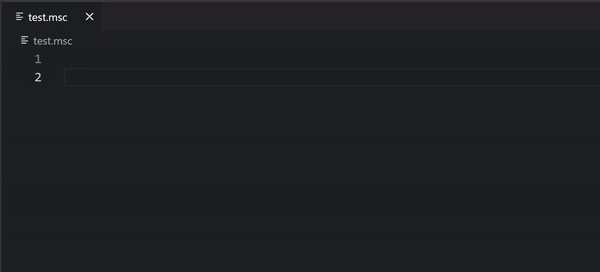
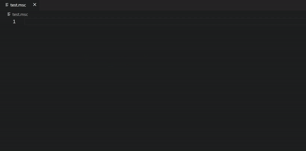
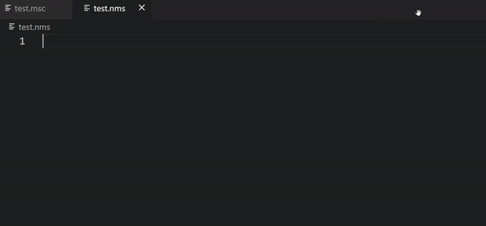

# Minr Scripts Extension README

This extension adds syntax highlighting and code completion functionalities for minr.org Minecraft server scripts (MSC) and fast upload and download functions to paste.minr.org.

## Features

### Syntax highlighting

Highlighting is applied to files with .msc extension.


### Code completion

Extension features a wide range of code completion functionalities.

It will suggest following items:
1. Variables. This means all local variables defined in the script up to the cursor position. If you're writing a function script and want parameter suggestions, add comment with parameter names to the first line of the script like this (for example, ```# Int param1, Double param2```).
2. Namespaces. To get suggestions for your namespace, you need to define .nms file, which is described at the bottom of this readme. Then you will get suggestions for your namespaces, it's variables, functions and classes. You can also add documentation to all those items, and it'll show in code completion.
3. Classes (types). Extension already includes suggestions for most default classes. It also has documentation for all their fields, methods and constructors, so you won't have to search the script docs. User defined classes can be added inside namespaces with .nms files.
4. Functions. Functions from custom namespaces will be suggested. As you type in function arguments, function signature, function documentation and active parameter are shown.
5. Command operators. Extension suggests autocompletion for most common command operators, (for example, ```@player```, ```@prompt```, etc).

Note that when you're typing something at the beginning of the line, only command operator suggestions will work. You need to first type some operator (for example, ```@var```) and only then full suggestions will be shown.

This extension also provides hover hints: if you hover your mouse over variable, function or field name, it'll show it's information.




### Upload and download to paste.minr.org

The upload function uploads currently opened file and copies the resulting URL to clipboard. The download function downloads file from the URL currently in clipboard and opens it in editor.

They can be accessed through Command Palette (Ctrl+Shift+P) by searching for 'Upload script' and 'Download script'. Also keyboard shortcuts are available: Alt+U and Alt+D. They can be reassigned in 'Preferences: Open Keyboard Shortcuts' in Command Palette.

## Custom namespace Files (.nms)

You can make a custom namespace file for your namespace to get code completion. Extension automatically scans currently opened folder for .nms files and updates them on save. You'll have to open folder (File -> Open Folder) to use them.

By calling upload (Alt+U) with .nms file open, extension will automatically generate script for namespace import. **Be careful. Namespace import script automatically removes everything contained in the namespace at the start of execution. Only execute it if you already have fully documented your namespace in .nms and .msc.**

The format is as following (documentation is optional, and consists of one or multiple lines of comments directly above variable, function, field, method, or class definition. It will be shown in code completion suggestions):

```
@namespace myNamespace
	# myFunc documentation
	Int myFunc(Player player, Item item)
	myVoidFunc()
	# myVar documentation
	Double myVar

	# myClass documentation
	@class myClass
		# constructor
		myClass(Double value)
		# field
		Double myField
		# getter
		Double getMyField()
		# setter
		setMyField(Double newValue)
		myNamespace::myClass getMyClass()
	@endclass myClass
@endnamespace
```
Note that any use of variables and classes in .nms file has to include the namespace. For example, the ```getMyClass()``` method in example returns ```myNamespace::myClass```, not just ```myClass```. The only exception is the constructor name.



## Release Notes

### 2.1.0

Added namespace upload.

### 2.0.0

Added code completion, signature help, hover help, custom namespaces.

### 1.1.0

Added code snippets.

### 1.0.0

Initial release of Minr Scripts Extension.