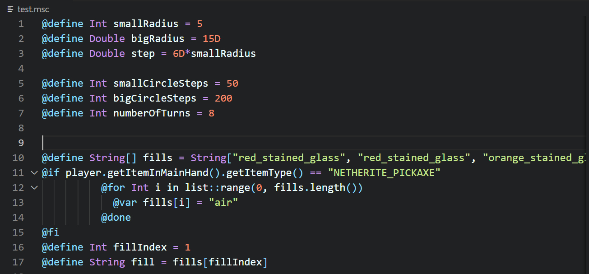

# Minr Scripts Extension README

This extension adds basic syntax highlighting for minr.org Minecraft server scripts and fast upload and download functions to paste.minr.org.

## Features

### Syntax highlighting

Highlighting is applied to files with .msc extension.

### Upload and download to paste.minr.org

The upload function uploads currently opened file and copies the resulting URL to clipboard. The download function downloads file from the URL currently in clipboard and opens it in editor.

They can be accessed through Command Palette (Ctrl+Shift+P) by searching for 'Upload script' and 'Download script'. Also keyboard shortcuts are available: Alt+U and Alt+D. They can be reassigned in 'Preferences: Open Keyboard Shortcuts' in Command Palette.

## Release Notes

### 1.1.0

Added code snippets.

### 1.0.0

Initial release of Minr Scripts Extension.