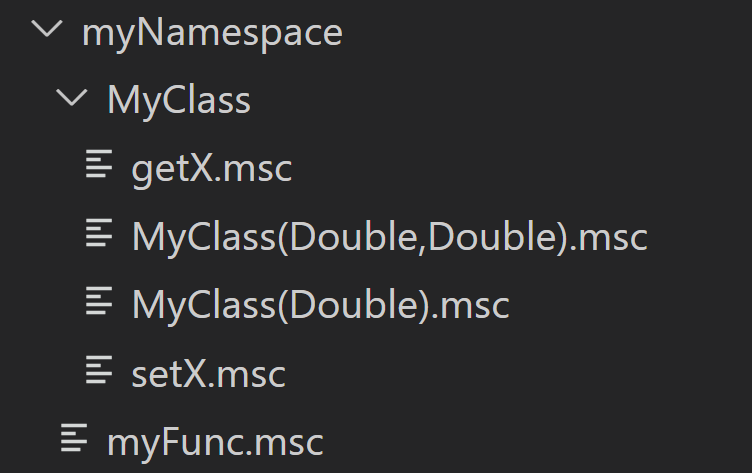

# Minr Scripts VSCode Extension README

This Visual Studio Code extension adds syntax highlighting and code completion functionalities for minr.org Minecraft server scripts (MSC), as well as fast upload and download to paste.minr.org. The extension is available to download at [Visual Studio Marketplace](https://marketplace.visualstudio.com/items?itemName=Lightwood13.msc).

## Features

### Syntax Highlighting

Highlighting is applied to files with the .msc extension.


### Code Completion

The extension features a wide range of code completion functionalities.

It will suggest the following items:
1. Variables. This means all local variables defined in the script up to the cursor position. If you're writing a function script and want parameter suggestions, add comment with parameter names to the first line of the script like this (for example, ```# Int param1, Double param2```).
2. Namespaces. To get suggestions for your namespace, you need to define a .nms file, which is described at the bottom of this document. You will then get suggestions for your namespaces as well as their variables, functions and classes. You can also add documentation to all those items, which will show up in code suggestion.
3. Classes (types). The extension already includes suggestions for most default classes. It also has documentation for all their fields, methods and constructors, so you won't have to search the MSC documentation. User defined custom types can be added inside namespaces with .nms files.
4. Functions. Functions from custom namespaces will be suggested. As you type in function arguments, the function signature, documentation and active parameter are shown.
5. Command operators. Extension suggests autocompletion for command operators like `@define` and `@prompt`.

Note that when you're typing something at the beginning of the line, only command operator suggestions will work. You need to first type some operator (for example, `@var`) and only then full suggestions will be shown.

This extension also provides hover hints: if you hover your mouse over a variable, function or field name, the extension will show its information.


### Upload/Download using [Hastebin](https://paste.minr.org/)

The upload function uploads the currently opened file and copies the resulting URL to clipboard. The download function downloads the script from the URL currently stored in the user's clipboard and opens it in a new tab of the editor.

They can be accessed through Command Palette (Ctrl+Shift+P) by searching for 'Upload script' and 'Download script'. Keyboard shortcuts are also available: `Alt+U` and `Alt+D` by default. They can be reassigned in 'Preferences: Open Keyboard Shortcuts' in Command Palette.

### Namespace Import / Update

When calling 'Upload script' with a .nms file open, the extension will automatically generate script for namespace import. This script sets up your namespace from scratch, defining everything you need, and possibly running an initialisation function (optionally included as `__init__.msc` in a namespace folder).

The script defines all variables, functions and classes (as well as their members) present in the namespace. It then searches the workspace folder for .msc files corresponding to the functions present in the namespace. These files should be put in a folder with the same name as the namespace. Custom methods should be put in a subfolder with the type name inside the namespace folder. An example folder structure is shown in the image below.

The import script generated must be applied as an interact script to a block. It automatically removes itself after execution. **Be careful: the namespace import script automatically removes everything contained in the namespace at the start of its execution. Only execute it if you already have the full namespace definition in your namespace file, and all your functions are backed up.**

You can also update a namespace using the 'Update namespace' command. This only imports scripts, sets variables, and runs the namespace initialisation function, without removing and redefining the namespace.



## Custom Namespace Files (.nms)

You can make a custom namespace file for your namespace to get code completion. Extension automatically scans currently opened folder for .nms files and updates them on save. You'll have to open folder (File -> Open Folder) to use them.

The format is as following (documentation is optional, and consists of one or multiple lines of comments directly above variable, function, field, method, or class definition. It will be shown in code completion suggestions):

```
@namespace myNamespace
	# myFunc documentation
	Double myFunc(Player player, Item item)
	myVoidFunc()
	# myVar documentation
	Double myVar

	# myClass documentation
	@class MyClass
		# constructor
		MyClass(Double value)
		# another constructor
		MyClass(Double value1, Double value 2)
		# field
		Double x
		# getter
		Double getX()
		# setter
		setX(Double newValue)
		myNamespace::MyClass getMyClass()
	@endclass
@endnamespace
```
Note that any use of variables and classes in .nms file has to include the namespace. For example, the ```getMyClass()``` method in example returns ```myNamespace::myClass```, not just ```myClass```. The only exception is the constructor name.


## Release Notes

### 3.0.0

Added command completion, error highlighting, automatic formatting, and improved autofill.

### 2.1.0

Added namespace upload.

### 2.0.0

Added code completion, signature help, hover help, custom namespaces.

### 1.1.0

Added code snippets.

### 1.0.0

Initial release of Minr Scripts Extension.
