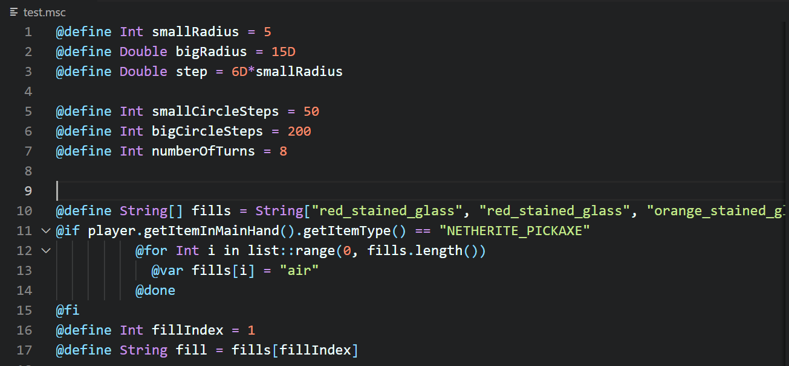
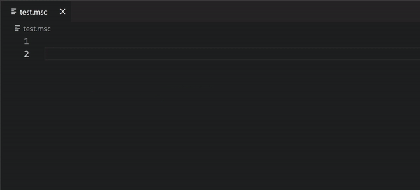
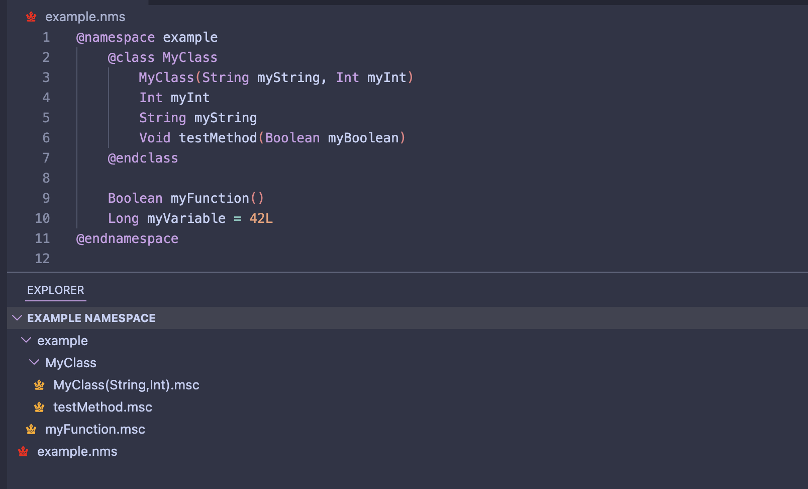
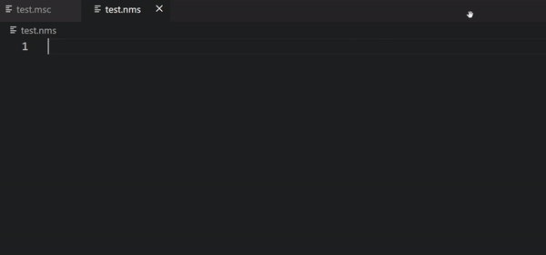

# Minr Scripts VSCode Extension

This Visual Studio Code extension adds syntax highlighting and code completion functionalities for Minr Script Code (MSC), as well as fast upload and download to [paste.minr.org](https://paste.minr.org). The extension is available for download at [Visual Studio Marketplace](https://marketplace.visualstudio.com/items?itemName=Lightwood13.msc).

## Features

### Syntax Highlighting

Highlighting is applied to files with the `.msc` extension.



### Code Completion

The extension features a wide range of code completion functionalities.

The extension will suggest the following items:
1. Namespaces. To get suggestions for your namespace, define a `.nms` file, described at the bottom of this document.
2. Variables, including local variables defined in the script at the cursor position and namespaced variables which are in scope.
3. Classes (types). The extension already includes suggestions for all default types, as well as documentation for all their fields, methods and constructors. User-defined custom types can be added inside namespace files.
4. Functions. Functions from custom namespaces will be suggested. As you type in function arguments, the function signature, documentation and active parameter are shown.
5. Command operators. Extension suggests autocompletion for command operators like `@define` and `@prompt`.

Note that when you're typing something at the beginning of the line, only command operator suggestions will work. You need to first type some operator (for example, `@var`) and only then full suggestions will be shown.

This extension also provides hover hints: if you hover your mouse over a variable, function or field name, the extension will show its information. You can ctrl-click or press F12 on local variables to jump to their declarations, on custom namespace functions and methods to jump to their backing script files when available, and on constructors to jump to their namespace declarations.



### Upload/Download using [Hastebin](https://paste.minr.org/)

The upload function uploads the currently opened file to paste.minr.org and copies the resulting URL to the clipboard. The copy import link function uploads the currently opened file and copies the full `/script import ...` command to the clipboard when the file belongs to a namespace-backed function, constructor, method. The download function downloads the script from the URL currently stored in the user's clipboard and opens it in a new tab of the editor.

These features can be accessed through the Command Palette (Ctrl+Shift+P) by searching for 'MSC: Upload script', 'MSC: Copy import link', and 'MSC: Download script'. Keyboard shortcuts are also available for upload and download: `Alt+U` and `Alt+D` by default. These can be reassigned in 'Preferences: Open Keyboard Shortcuts' in the Command Palette.

### Namespace Import / Update

When calling 'Upload script' with a `.nms` file open, the extension will automatically generate script for namespace import. This script sets up your namespace from scratch, defining everything you need, and possibly running an initialisation function (optionally included as `__init__.msc` in a namespace folder).

The script defines all variables, functions and classes (as well as their members) present in the namespace. It then searches the workspace folder for `.msc` files corresponding to the functions present in the namespace. These files should be put in a folder with the same name as the namespace. Custom methods should be put in a subfolder with the type name inside the namespace folder. An example folder structure is shown in the image below.

The import script generated must be applied as an interact script to a block. It automatically removes itself after execution. **Be careful: the namespace import script automatically removes everything contained in the namespace at the start of its execution. Only execute it if you already have the full namespace definition in your namespace file, and all your functions are backed up.**

You can also update a namespace using the 'Update namespace' command. This only imports scripts, sets variables, and runs the namespace initialisation function, without removing and redefining the namespace.

## Custom Namespace Files

You can make a custom namespace file for your namespace using the `.nms` file extension. The currently open folder is automatically scanned for these files.

An example format is defined below. Adding documentation with comments is optional: one or multiple lines of comments directly above a variable, function, field, method, or class definition creates a comment which will be shown in code completion suggestions.

```
@namespace myNamespace
	# myFunc documentation
	Double myFunc(Player player, Item item)
	myVoidFunc()
	# myVar documentation
	Double myVar

	# myClass documentation
	@class MyClass
		# constructor
		MyClass(Double value)
		# another constructor
		MyClass(Double value1, Double value 2)
		# field
		Double x
		# getter
		Double getX()
		# setter
		setX(Double newValue)
		myNamespace::MyClass getMyClass()
	@endclass
@endnamespace
```

Each namespace should be backed up by a corresponding folder which contains the relevant script files.



Note that any use of variables and classes in .nms file has to include the namespace. For example, the ```getMyClass()``` method in example returns ```myNamespace::myClass```, not just ```myClass```. The only exception is the constructor name.



## Release Notes

See [the changelog](docs/CHANGELOG.md) for the full version history.
